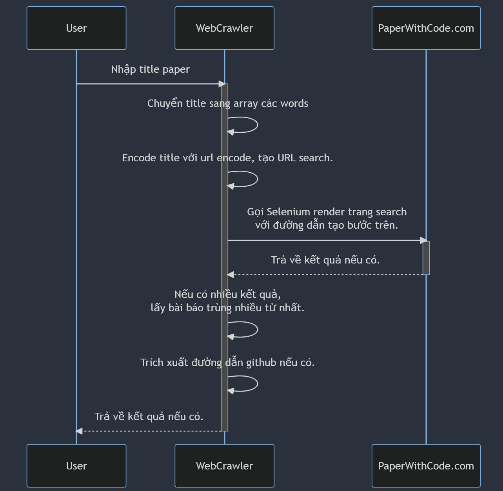

# Find a paper then check if existing any implementation that's public.


### Logic description.


### Install packages:

```
pip install -r requirements.txt
```


### Use application

```
python3 ./find_github.py "input_your_paper_title_here"
```

Sample request
```
python3 ./find_github.py "ToolLLM: Facilitating Large Language Models to Master 16000+ Real-world APIs"
```


Sample result:
```
title: ToolLLM: Facilitating Large Language Models to Master 16000+ Real-world APIs
github urls: 
1: https://github.com/openbmb/toolbench
```